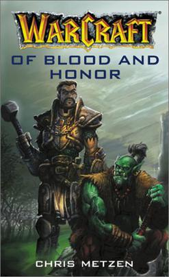

===========
血与荣耀
===========

:英文名: Of Blood and Honor
:作者: Chris Metzen
:译者: - Sir Noran，the Royal Historian
       - Fanbu, an ordinary tippler in the Gilded Rose Inn

高贵的圣骑士提里奥·弗丁曾认为野蛮的兽人是邪恶与腐化的象征，他的一生都在为保护人类免受兽人侵蚀而奋斗。但兽人的一次充满荣誉和怜悯的行为让弗丁的信仰发生了松动，他不得不重新在人和怪物的界限上做出决定。

.. toctree::
    :maxdepth: 2
    :caption: 目录

    chapter1
    chapter2
    chapter3
    chapter4
    chapter5
    chapter6
    chapter7
    chapter8

参考

- `灰机wiki: 鲜血与荣耀 <https://warcraft.huijiwiki.com/wiki/%E9%B2%9C%E8%A1%80%E4%B8%8E%E8%8D%A3%E8%80%80>`_
- `Wowpedia: Of Blood and Honor <https://wow.gamepedia.com/Of_Blood_and_Honor>`_